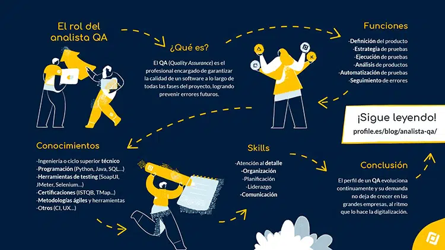
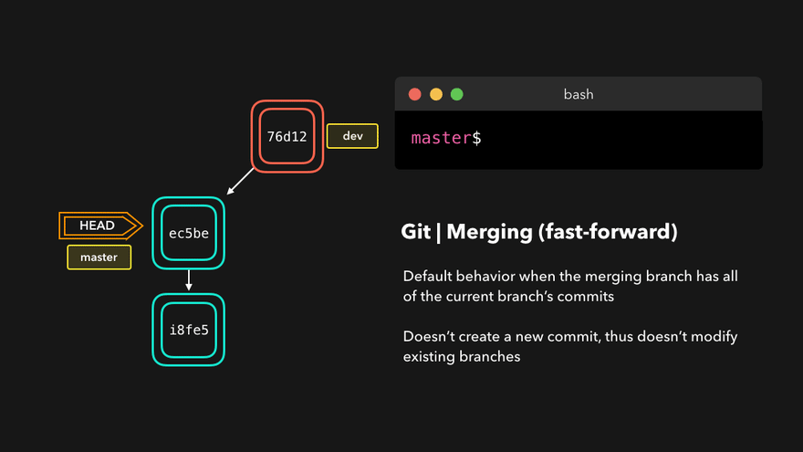
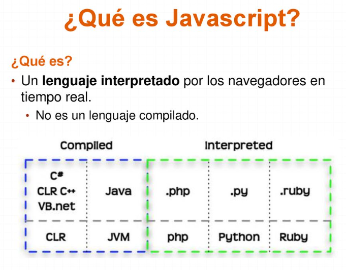
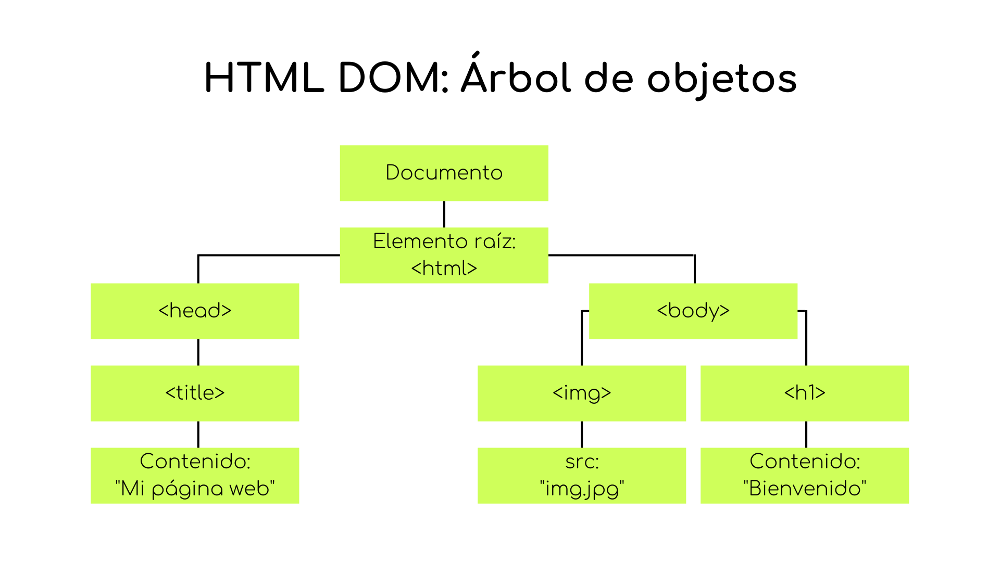
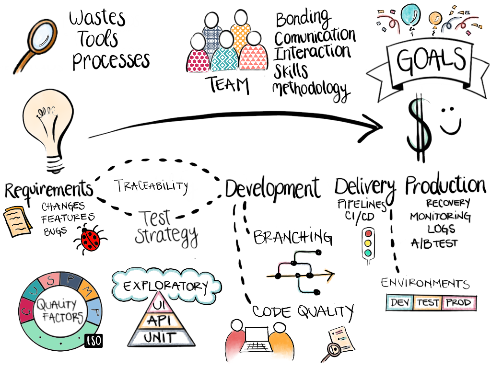
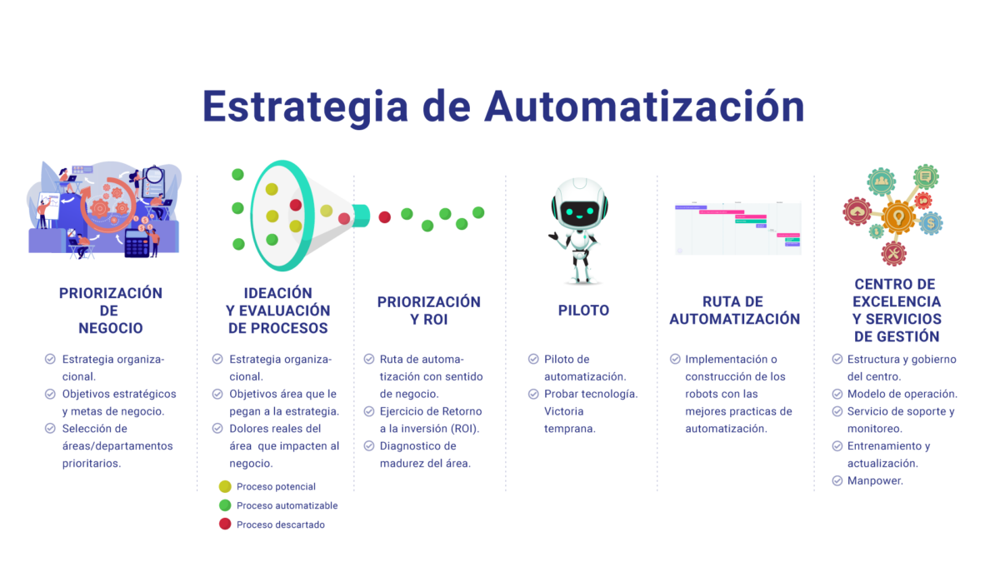
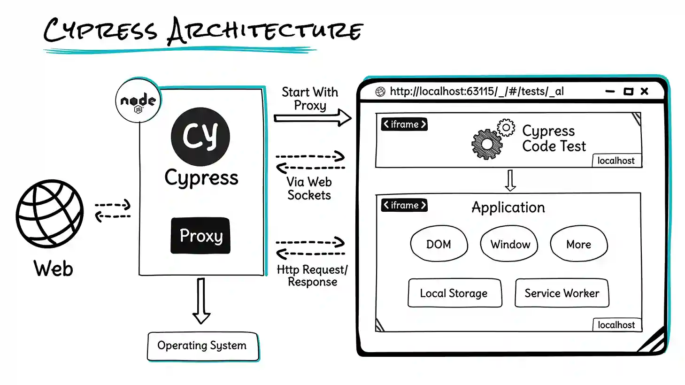
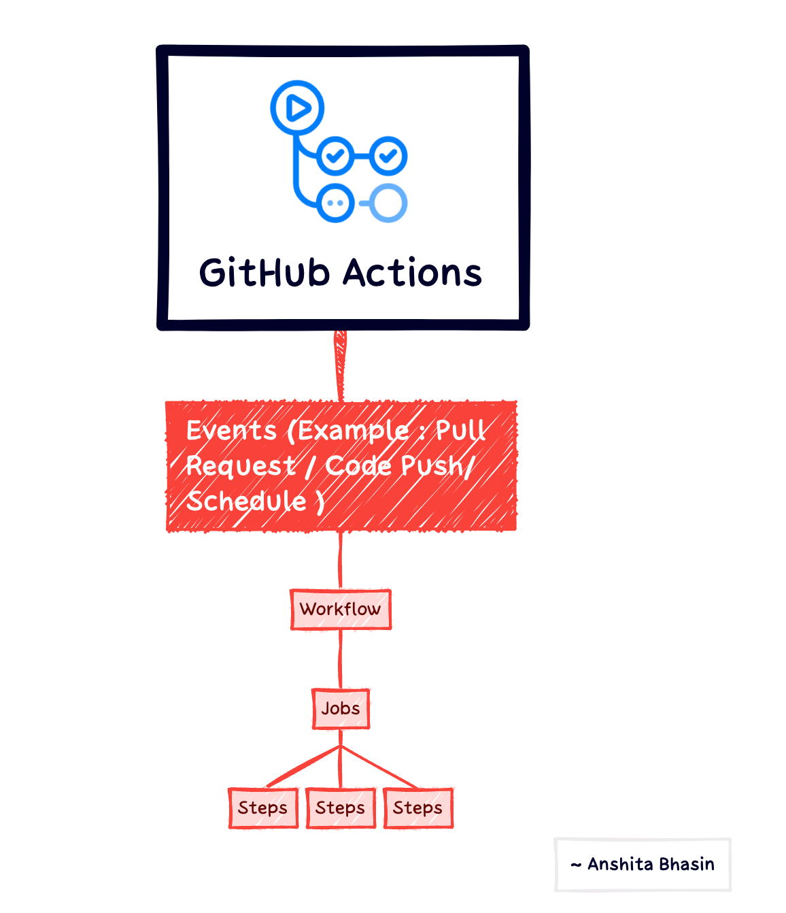
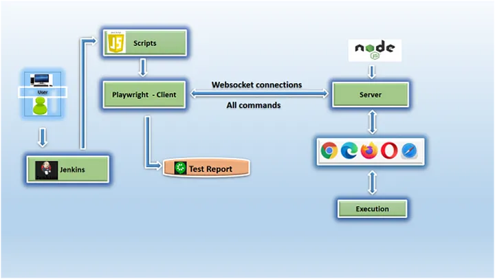

---

# Introducción a QA y Git

## Conceptos básicos de QA
- **Definición de QA**: Calidad del software y aseguramiento de la calidad.
- **Importancia del QA en el desarrollo de software**: Mejora la calidad, reduce costos, asegura la satisfacción del cliente.
- **Roles en QA**:
  - Tester: Ejecuta casos de prueba y reporta errores.
  - QA Engineer: Diseña y automatiza pruebas.
  - QA Lead: Lidera el equipo de QA y define estrategias.

## Git y Control de Versiones

### Instalación y configuración de Git
- **Instalación de Git en diferentes sistemas operativos**: Windows, macOS, Linux.
- **Configuración inicial de Git**:
  - `git config --global user.name "Tu Nombre"`
  - `git config --global user.email "tu.email@ejemplo.com"`

### Comandos básicos de Git
- **Inicializar un repositorio**: `git init`
- **Clonar un repositorio**: `git clone <url>`
- **Hacer commits**: `git commit -m "Mensaje"`
- **Pushear cambios**: `git push origin <rama>`

### Flujos de trabajo en Git
- **Git Flow**: Gestión de ramas para desarrollo y lanzamiento.
- **GitHub Flow**: Simplificación del flujo de trabajo para desarrollo en GitHub.
- **GitLab Flow**: Integración continua y despliegue.

### Gestión de ramas
- **Creación y fusión de ramas**: `git branch`, `git checkout -b <rama>`, `git merge <rama>`
- **Resolución de conflictos**: Estrategias y herramientas para resolver conflictos de merge.

---

# Programación en JavaScript desde cero

## Fundamentos de JavaScript
- **Sintaxis básica**: Variables, operadores, estructuras de control.
- **Variables**: `var`, `let`, `const`
- **Tipos de datos y estructuras**:
  - Strings, números, booleanos
  - Arrays
  - Objetos
  - Funciones

## Funciones y Ámbitos
- **Definición y uso de funciones**: Declarativas, expresivas.
- **Funciones anónimas y flecha**: Simplificación y contexto `this`.
- **Ámbito de variables y closures**: Scope local y global, closures para mantener estados.

## Programación orientada a objetos en JavaScript
- **Clases y objetos**: Definición de clases, creación de objetos.
- **Herencia y polimorfismo**: Extender clases, métodos polimórficos.
- **Métodos y propiedades**: Métodos estáticos y de instancia, getters y setters.

## Manipulación del DOM
- **Eventos y manejo de eventos**: Asignación y manejo de eventos.
- **Selección y modificación de elementos**: Métodos de selección, actualización de contenido.
- **Creación y eliminación de nodos**: Añadir y quitar elementos del DOM.
- **Herramientas**: Jest, Mocha para pruebas unitarias.

---

# Diseño de Estrategias de Pruebas Automáticas

## Tipos de pruebas
- **Pruebas unitarias**: Verificación de componentes individuales.
- **Pruebas de integración**:
  - **Estrategias**: Big Bang, Incremental.
- **Pruebas funcionales**: Validación de funcionalidad completa.
- **Herramientas**: Selenium, Cypress.

## Estrategias de automatización
- **Selección de herramientas de prueba**: Criterios de selección, comparación de herramientas.
- **Diseño de casos de prueba**: Identificación de escenarios, definición de criterios de aceptación.
- **Mantenimiento de scripts de prueba**: Actualización y refactorización continua.
- **Gestión de datos de prueba**: Creación, manejo y limpieza de datos.

---

# Automatización de Pruebas con Cypress y Cucumber

## Introducción a Cypress
- **Instalación y configuración**: Instalación desde npm, configuración básica.
- **Estructura de una prueba**: Organización de archivos y carpetas.
- **Uso de selectores**: Estrategias para seleccionar elementos en la página.
- **Pruebas de UI y API**: Validación de interfaces de usuario y servicios backend.

## Uso de Cucumber con Cypress
- **Introducción a Cucumber**: Fundamentos de BDD, sintaxis de Gherkin.
- **Integración de Cucumber con Cypress**: Configuración y uso conjunto.
- **Escritura de pruebas en Gherkin**: Definición de escenarios y pasos.

## Ejecución de Pruebas Cypress con Integración Continua (CI)
- **Configuración de entornos CI**: Jenkins, GitHub Actions, GitLab CI.
- **Integración de Cypress en pipelines de CI**: Automatización de pruebas en el pipeline.
- **Reportes y análisis de resultados**: Generación y análisis de reportes de pruebas.

---

# Automatización de Pruebas con Playwright y Cucumber

## Introducción a Playwright
- **Instalación y configuración**: Instalación desde npm, configuración inicial.
- **Pruebas de múltiples navegadores**: Estrategias para pruebas en diferentes navegadores.
- **Navegación y acciones**: Interacción con la página, navegación, y acciones comunes.

## Uso de Cucumber con Playwright
- **Integración de Cucumber con Playwright**: Configuración y uso conjunto.
- **Escritura de pruebas en Gherkin**: Definición de escenarios y pasos para Playwright.

## Ejecución de Pruebas Playwright con Integración Continua (CI)
- **Configuración de entornos CI**: Jenkins, GitHub Actions, GitLab CI.
- **Integración de Playwright en pipelines de CI**: Automatización de pruebas en el pipeline.
- **Reportes y análisis de resultados**: Generación y análisis de reportes de pruebas.

