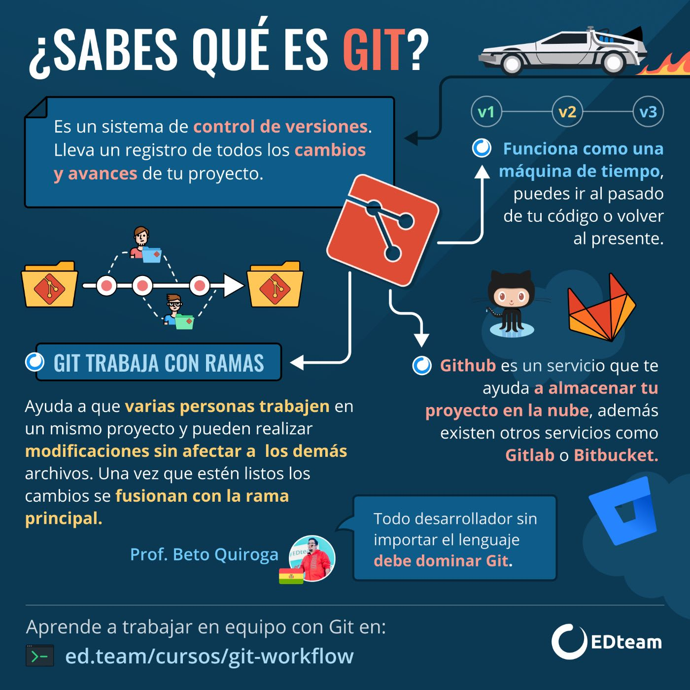

## Introducción

Git es un sistema de control de versiones distribuido, diseñado para manejar proyectos con velocidad y eficiencia. Es usado ampliamente en el desarrollo de software para rastrear cambios en el código fuente y facilitar la colaboración entre múltiples desarrolladores.


<center></center>


---

## 1. Instalación de Git

### Para instalar Git, sigue estos pasos dependiendo de tu sistema operativo:

### Windows
1. Descarga el instalador desde [git-scm.com](https://git-scm.com/download/win).
2. Ejecuta el instalador y sigue las instrucciones del asistente.
3. Para verificar la instalación, abre `Git Bash` y escribe:
    ```bash
    git --version
    ```

### macOS
1. Abre `Terminal`.
2. Escribe el siguiente comando:
    ```bash
    brew install git
    ```
   (Necesitas tener Homebrew instalado. Si no lo tienes, puedes instalarlo desde [brew.sh](https://brew.sh/)).

### Linux
1. Abre tu terminal.
2. Escribe el siguiente comando (dependiendo de tu distribución):
    ```bash
    sudo apt-get install git        # Debian/Ubuntu
    sudo yum install git            # CentOS/RHEL
    sudo dnf install git            # Fedora
    ```

---

## 2. Configuración Inicial

Después de instalar Git, es importante configurarlo con tu información personal:

1. Configura tu nombre de usuario:
    ```bash
    git config --global user.name "Tu Nombre"
    ```

2. Configura tu correo electrónico:
    ```bash
    git config --global user.email "tuemail@ejemplo.com"
    ```

3. Verifica tu configuración:
    ```bash
    git config --list
    ```

---

## 3. Comandos Básicos de Git

### Inicializar un Repositorio

Para crear un nuevo repositorio, navega a tu directorio de proyecto y escribe:
```bash
git init
```

### Clonar un Repositorio

Para clonar un repositorio existente desde un servidor remoto:

```bash
git clone <url-del-repositorio>
```

### Ver el Estado del Repositorio

Para ver los cambios en tu proyecto:

```bash
git status
```

### Añadir Cambios al Área de Staging

Para añadir archivos específicos:

```bash
git add <archivo>
```
Para añadir todos los archivos:

```bash
git add .
```

### Confirmar Cambios

Para confirmar los cambios en el área de staging:
```bash
git commit -m "Mensaje descriptivo"
```

### Ver el Historial de Confirmaciones

Para ver el historial de commits:

```bash
git log
```

## 4. Trabajando con Ramas

### Crear una Nueva Rama

Para crear una nueva rama:

```bash
git branch <nombre-de-la-rama>
```

### Cambiar de Rama
Para cambiar a una rama existente:

```bash
git checkout <nombre-de-la-rama>
```

### Crear y Cambiar a una Nueva Rama
Para crear y cambiar a una nueva rama al mismo tiempo:

```bash
git checkout -b <nombre-de-la-rama>
```


### Fusionar Ramas
Para fusionar una rama en tu rama actual:

```bash
git merge <nombre-de-la-rama>
```

### Eliminar una Rama
Para eliminar una rama:

```bash
git branch -d <nombre-de-la-rama>
```

## 5. Trabajo Remoto

<center></center>


### Añadir un Remoto

Para añadir un repositorio remoto:

```bash
git remote add origin <url-del-repositorio>
```

### Ver Remotos
Para listar los remotos configurados:

```bash
git remote -v
```

### Obtener Cambios del Remoto
Para obtener cambios desde el remoto:

```bash
git pull origin <rama>
```

### Enviar Cambios al Remoto
Para enviar tus commits al remoto:

```bash
git push origin <rama>
```


## 6. Prácticas Recomendadas
   
1. Commits Frecuentes: Realiza commits frecuentemente para mantener un historial claro.
   Mensajes de Commit Descriptivos: Usa mensajes descriptivos para facilitar el seguimiento de cambios.
2. Uso de Ramas: Utiliza ramas para trabajar en nuevas características o arreglos sin afectar la rama principal.
3. Sincronización Frecuente: Sincroniza tus cambios frecuentemente con el repositorio remoto para evitar conflictos.


## 7.Recursos Adicionales

- [Documentación Oficial de Git](https://git-scm.com/doc) - Encuentra la documentación completa de Git, incluyendo guías y referencias detalladas.
- [Pro Git Book](https://git-scm.com/book/en/v2) - Accede a un libro completo sobre Git, disponible en varios idiomas, que cubre desde los fundamentos hasta técnicas avanzadas.
- [Try Git](https://try.github.io/) - Prueba Git en tu navegador, ofrecido por Code School, ideal para principiantes que desean aprender los comandos básicos de Git de manera interactiva.


