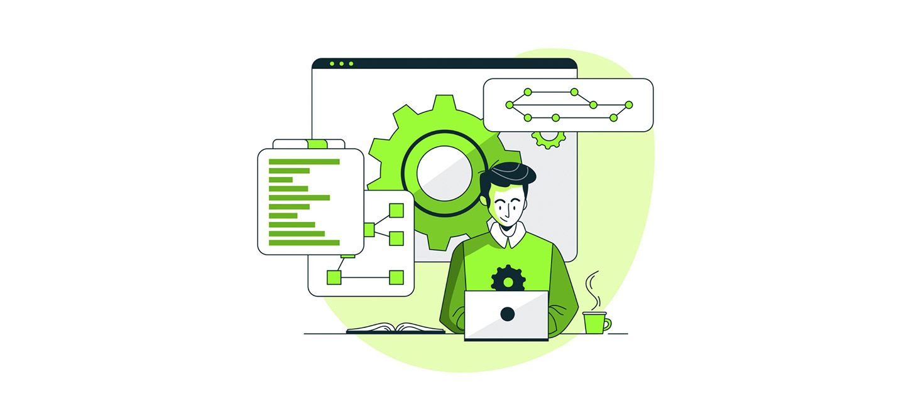
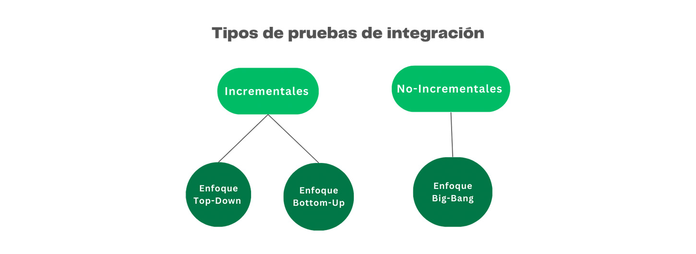
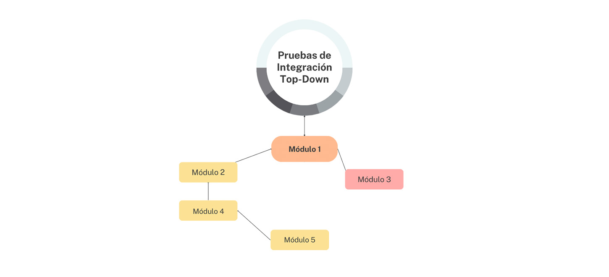
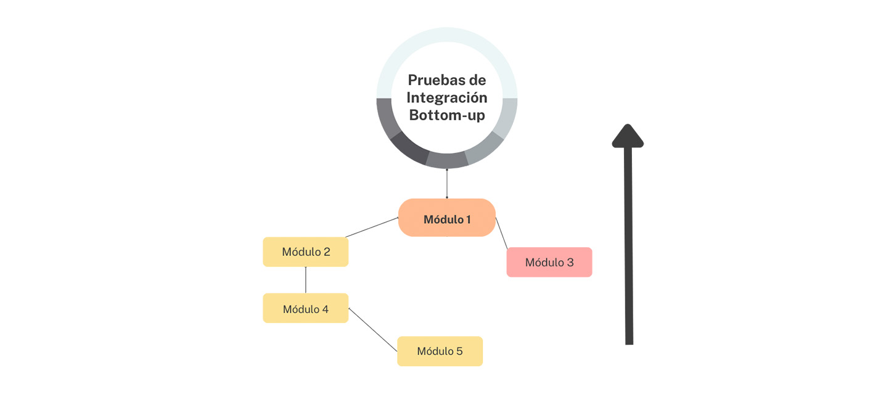
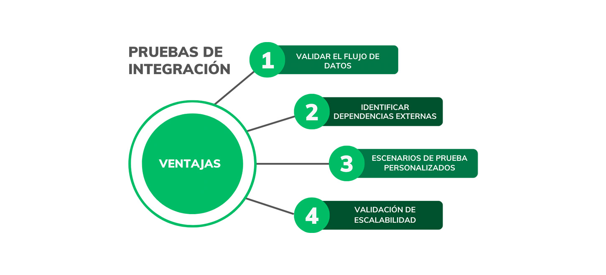

## Pruebas de Integración: qué son, tipos y ejemplos

La creación de aplicaciones complejas e interconectadas se ha convertido en una norma en el mundo del desarrollo de software. Dado que las innovaciones tecnológicas y las demandas de los consumidores aumentan, la perfecta integración de múltiples elementos se ha convertido en un indicador clave del éxito del software.

Las pruebas son esenciales para garantizar el óptimo funcionamiento y la fiabilidad de los sistemas informáticos. La realización de pruebas al inicio del proceso de desarrollo puede ayudar a identificar y corregir errores. Esto supone un valioso ahorro de tiempo, dinero y esfuerzo en las fases posteriores del desarrol




Los desarrolladores pueden ofrecer un software robusto que satisfaga las necesidades del usuario con la ayuda de las pruebas de integración de sistemas. Sin embargo, surge una pregunta: ¿Qué son las pruebas de integración? ¿Cómo pueden llevarse a cabo y qué tipos hay? Para responder esto, profundicemos en este tema. Este blog también explorará las pruebas unitarias frente a las pruebas de integración, así como un ejemplo de estas últimas.

### ¿Qué son las Pruebas de Integración?
Este tipo de pruebas evalúa la forma en que interactúan y operan varios módulos de aplicaciones de software de forma cohesiva. El sistema se divide en componentes conocidos como módulos o unidades. Cada módulo es responsable de una tarea específica. El verdadero desafío llega cuando combinamos estos componentes para desarrollar todo el sistema de software.

En esta etapa, se comienza a examinar cuidadosamente las conexiones entre cada módulo para descubrir cualquier problema potencial que resulte de una sola unidad. Cuando las pruebas han finalizado, se realizan pruebas de punta a punta para evaluar la funcionalidad de la aplicación de principio a fin.

Los módulos del software son combinados manualmente y se evalúan sus relaciones en las pruebas manuales de componentes. Las pruebas manuales pueden ser costosas y vulnerables al error humano. Puede resultar desafiante cubrir adecuadamente todas las posibilidades de integración en sistemas complicados, por tanto, para abordar estos problemas se suele emplear la automatización.

La integración continua y las prácticas de entrega continua ayudan en la automatización. Los pipelines CI/CD automatizan el desarrollo del código, de las pruebas y de la implantación. Las herramientas CI/CD ejecutan pruebas de integración de forma automática para verificar que el nuevo código se integra correctamente con el sistema existente. Simplifica la resolución de los problemas antes de que se agraven, ya que permite hacer aportaciones inmediatas a los desarrolladores.

Al igual que otros procedimientos de pruebas, las pruebas de integración de sistemas implican una serie de pasos para crear una aplicación sin errores. A continuación se describen algunos puntos esenciales a tener en cuenta:

- Crear un plan de pruebas: El plan de pruebas incluye los objetivos, alcance y enfoque de la fase de pruebas. Esto ayuda a los testers y partes interesadas a entender cómo se llevarán a cabo las pruebas.
- Comenzar con módulos esenciales: Dar prioridad a los módulos más vitales al desarrollar los casos de prueba. Es probable que estos componentes generen problemas si no son integrados adecuadamente.
- Usar herramientas diversas: Existen numerosas herramientas para implementar y ejecutar pruebas de integración. Seleccionen las herramientas que cumplan mejor sus requerimientos y restricciones financieras.
- Realizar las pruebas en varios entornos: Esto garantizará que las pruebas sean sólidas y capten cualquier error en múltiples entornos.
- Evaluar los resultados minuciosamente: Esta es una etapa crucial en el proceso de pruebas. Puedes descubrir cualquier fallo que requiera ser reparado al evaluar cuidadosamente los hallazgos.  Pruebas Unitarias vs. Pruebas de Integración

### Las pruebas unitarias y de integración

tienen propósitos distintos y se llevan a cabo en varias fases del ciclo de vida de desarrollo. La siguiente tabla compara las diferencias entre las pruebas unitarias y las pruebas de integración:

| Aspecto                    | Pruebas Unitarias                                               | Pruebas de Integración                                      |
|----------------------------|-----------------------------------------------------------------|-------------------------------------------------------------|
| **Alcance**                | Se concentran en unidades o módulos particulares.               | Evaluan la interacción de módulos integrados.               |
| **Objetivo**               | Comprobar que cada elemento funciona de forma independiente.    | Comprobar que todas las piezas conectadas entre sí funcionan correctamente. |
| **Interoperabilidad**      | Las dependencias externas se mantienen separadas de las pruebas.| Se requiere la integración con módulos del mundo real.     |
| **Velocidad**              | Puesto que se concentra en unidades pequeñas, la ejecución es más rápida.| El tiempo de ejecución es un poco mayor debido a las pruebas de los diversos módulos. |
| **Cobertura**              | Ofrece cobertura extensiva de código al inspeccionar módulos de forma exhaustiva. | Garantiza que los módulos funcionen correctamente como elemento del sistema general. |
| **Flujo de Trabajo de las Pruebas** | Normalmente, los desarrolladores realizan pruebas unitarias antes que las pruebas de integración. | Estas suelen llevarse a cabo durante la fase de integración del software. |




**Se pueden dividir en dos subtipos**:

- Pruebas incrementales
- Pruebas no incrementales

Las pruebas incrementales consisten en probar módulos de software en pequeños incrementos. Las pruebas de software comienzan con partes más pequeñas y avanzan progresivamente a través de todo el sistema.

Cada prueba mejora el software al integrar los módulos adicionales. En comparación con probar el sistema completo de forma simultánea, esto ofrece ventajas, incluyendo una retroalimentación temprana, una resolución de problemas más directa y de menor complejidad. Las pruebas incrementales ofrecen dos tipos:

- Integración Top-Down
- Integración Bottom-Up

Las pruebas no incrementales consisten en probar módulos de software. En este tipo, las pruebas tienen lugar después de que todos los módulos hayan sido desarrollados y estén listos para su integración. Se prueba todo el software a la vez. Las pruebas no incrementales suelen conocerse como el enfoque de integración “big bang”. Veamos cómo funcionan estos tipos y qué ventajas ofrecen.

### Integración Top-Down

Las pruebas top-down emplean un enfoque sistemático para probar los módulos de software desde el nivel superior hacia abajo a través de la jerarquía del sistema. Las pruebas comienzan con el módulo principal del software y continúan con los submódulos de la aplicación.

Su objetivo principal es garantizar la funcionalidad entre los módulos de nivel superior y sus submódulos. A medida que el procedimiento de prueba avanza por la jerarquía, se comprueban las relaciones entre módulos para garantizar que los componentes del software funcionan según lo previsto.



Dado que los módulos de nivel superior se evalúan antes que los de nivel inferior, esta técnica permite descubrir en una fase temprana los fallos de diseño de alto nivel. Ayuda a detectar posibles problemas estructurales en las primeras fases de desarrollo.

Los “stubs” pueden emular módulos de nivel inferior, por lo que las pruebas pueden comenzar incluso antes de que estén totalmente construidos. Esto ayuda a mejorar el procedimiento de prueba y permite al equipo de desarrollo hacer aportaciones más rápidamente.

### Integración Bottom-Up

Cuando se realizan pruebas bottom-up, primero se prueban los módulos de nivel inferior. Se pasa gradualmente a los módulos de nivel superior y así sucesivamente, hasta que todas las facetas del software se han probado a fondo. Esta estrategia se denomina razonamiento inductivo. Resulta beneficiosa cuando se incorporan al producto final componentes ya existentes.



Implica escribir código para varios módulos en lugar de centrarse en “stubs” u objetos simulados. Por eso su tasa de éxito es mayor que la de otros enfoques.

Además, el tiempo de ejecución de las pruebas suele ser inferior al de otras metodologías tradicionales. Esto simplifica a los testers la realización de las pruebas y la construcción del proyecto para obtener los mejores resultados posibles.

### Enfoque Big-Bang

Implica compilar todos los módulos de software en una estructura y evaluarla como una unidad. Los módulos individuales no se examinan por separado. Se combinan y prueban en un único proceso.

Requiere una comunicación firme entre los equipos de desarrollo y de pruebas para identificar y resolver adecuadamente cualquier problema detectado durante el procedimiento de prueba. La estrategia big-bang puede ser más rápida y menos costosa que otros enfoques alternativos, ya que los desarrolladores no necesitan pruebas incrementales.

Esta estrategia podría funcionar para sistemas de software con menos relaciones entre componentes y menos complejas. Sin embargo, puede resultar difícil identificar el módulo preciso cuando se descubren fallos durante las pruebas. 

### Ventajas de las pruebas de integración

Al realizar las pruebas de integración, se examina cómo funciona el software completo como una unidad, tal y como lo hará cuando la gente lo utilice. El enfoque basado en el contexto implica examinar el entorno preciso en el que se utilizará el producto. Reconoce que el funcionamiento del software depende de algo más que de sus componentes.

También depende de cómo interactúan estos componentes cuando se ven como un todo. Es algo parecido a considerar cómo funciona un equipo en lugar de solo las habilidades de cada jugador.




#### EJEMPLO:

### Sistema de Reserva de Vuelos
El sistema diseñado para facilitar la reserva de vuelos se compone de varios módulos interconectados, cada uno encargado de gestionar distintos aspectos del proceso de reserva. La interacción entre estos módulos asegura una experiencia de usuario fluida y sin complicaciones. Los principales módulos incluyen:

- Módulo Principal (Interfaz de Usuario): Este módulo sirve como el punto de entrada para los usuarios, donde pueden introducir sus preferencias de viaje, incluyendo destinos, fechas y detalles del pasajero.
- Módulo de Búsqueda de Vuelos: Procesa la información ingresada por los usuarios, consulta una base de datos o APIs externas para encontrar vuelos que coincidan con los criterios especificados y presenta las opciones disponibles.
- Módulo de Pago: Se encarga de la gestión segura de las transacciones financieras necesarias para reservar vuelos.
- Módulo de Confirmación: Genera una confirmación de la reserva que incluye detalles críticos como las referencias de la reserva y los nombres de los pasajeros, y la opción de enviar o imprimir la confirmación.

**Enfoque Top-Down** Paso a Paso:

1. Mostrar el formulario de reserva: Inicias probando la interfaz de usuario desde donde los usuarios comienzan el proceso de reserva.
2. Realizar una reserva: Después de mostrar el formulario, el siguiente paso es completar la reserva de un vuelo, asegurándote de que la información enviada es procesada correctamente.
3. Procesar un pago: Una vez la reserva es exitosa, procedes a procesar el pago. Este paso verifica que el sistema maneje correctamente las transacciones financieras.
4. Confirmación del pago: Finalmente, confirmas que el pago ha sido procesado y registrado correctamente.

5. Este enfoque es útil para asegurarte de que la experiencia del usuario funcione de manera cohesiva desde el principio hasta el final.

**Enfoque Bottom-Up** Paso a Paso:

1. Procesar un pago: Comienzas con la funcionalidad que suele ser el fundamento del proceso de reserva: el pago.
2. Realizar una reserva: Después de asegurar que el pago se maneja correctamente, procedes a realizar una reserva utilizando los detalles de pago validados, comprobando que el sistema pueda integrar estos dos procesos sin problemas.

3. Este enfoque es ideal para validar los componentes desde el nivel más bajo al más alto, asegurando que los fundamentos funcionen correctamente antes de agregar capas adicionales de funcionalidad.

**Enfoque Big Bang** Paso a Paso:

1. Visualizar el formulario de reserva: Comienzas probando la visualización del formulario.
2. Realizar la reserva: Procedes inmediatamente a reservar un vuelo.
3. Procesar un pago: Sin detenerte, procesas el pago correspondiente a la reserva realizada.
4. Confirmar el pago: Por último, confirmas que el pago ha sido procesado adecuadamente.
5. Este enfoque prueba todos los componentes juntos, simulando un escenario de uso real y asegurando que todas las partes del sistema funcionen en conjunto adecuadamente.

```
proyecto-testunit-qa/
│
├── testIntegracion/
│ ├── app.js
│ ├── flightController.js
│ └── router.js
│
└── tests/
├── integration/
│ ├── big-bang.test.js
│ ├── bottom-up.test.js
│ └── top-down.test.js
├── jest/
│  ├── flightController.test.js
└── mocha/
│   ├── flightController.test.js
```

## Instalación de Dependencias

```bash
npm install express 
npm install supertest request --save-dev
```

### Iniciar el Servidor

Crear un archivo en la carpeta testIntegracion (si no existe creala) app.js es el punto de entrada del servidor. Aquí se configura y se inicia el servidor:

```javascript
const express = require('express');
const app = express();
const router = require('./router');

app.use(express.json()); // Middleware para parsear JSON
app.use('/api', router); // Rutas de la API

const PORT = process.env.PORT || 3000;
app.listen(PORT, () => console.log(`Server running on port ${PORT}`));

module.exports = app; // Exportar para pruebas

```

### Implementación del Controlador

El controlador maneja la lógica específica de las operaciones de reserva, cree un archivo llamado `flightController.js`  dentro de testIntegracion y copie el codigo
```javascript
exports.processPayment = (req, res) => {
    const { amount, cardDetails } = req.body;
    // Lógica para procesar el pago
    if (amount && cardDetails) {
        // Simulación de un proceso de pago exitoso
        res.status(200).json({ status: 'success', confirmationCode: 'PAY123' });
    } else {
        // Respuesta en caso de datos incompletos o erróneos
        res.status(400).json({ status: 'error', message: 'Payment details missing or incorrect' });
    }
};

exports.confirmPayment = (req, res) => {
    const { confirmationCode } = req.query;
    // Verificar el código de confirmación
    if (confirmationCode === 'PAY123') {
        res.status(200).json({ status: 'confirmed', details: 'Payment confirmed' });
    } else {
        res.status(404).json({ status: 'not found', message: 'Invalid confirmation code' });
    }
};


exports.showBookingForm = (req, res) => {
    // Mostrar formulario de reserva
    res.send(`<html><body><form action="/api/book" method="post">
            <input type="text" name="flightId" placeholder="Flight ID">
            <input type="text" name="userId" placeholder="User ID">
            <button type="submit">Book Flight</button>
            </form></body></html>`);
};

exports.bookFlight = (req, res) => {
    const { flightId, userId } = req.body;
    // Proceso de reserva de vuelo simulado
    if (flightId && userId) {
        res.json({ status: 'success', message: 'Flight booked', bookingId: 'BK123' });
    } else {
        res.status(400).json({ status: 'error', message: 'Booking details are incomplete' });
    }
};
```
### Configuración de Rutas en router.js


Define las rutas que conectarán las solicitudes HTTP con los controladores, creamos un archivo router,js dentro de la carpeta llamada testIntegracion
```javascript
const express = require('express');
const router = express.Router();
const flightController = require('./flightController');

router.get('/', flightController.showBookingForm);
router.post('/book', flightController.bookFlight);
router.post('/pay', flightController.processPayment);
router.get('/confirm', flightController.confirmPayment);

module.exports = router;
```

luego creamos las siguientes pruebas en 

test/jest/flightController.test.js

```javascript

const request = require('supertest');
const app = require('../../testIntegracion/app'); // Asegúrate de importar correctamente la app

describe('Flight Booking Controller', () => {
    it('should display the booking form', async () => {
        const response = await request(app).get('/api/');
        expect(response.statusCode).toBe(200);
        expect(response.text).toContain('Book Flight');
    });

    it('should handle a flight booking', async () => {
        const bookingDetails = { flightId: '1', userId: '1' };
        const response = await request(app).post('/api/book').send(bookingDetails);
        expect(response.statusCode).toBe(200);
        expect(response.body.status).toBe('success');
    });

    it('should process a payment successfully', async () => {
        const paymentData = { amount: 100, cardDetails: '1234-5678-9101-1121' };
        const response = await request(app).post('/api/pay').send(paymentData);
        expect(response.statusCode).toBe(200);
        expect(response.body.status).toBe('success');
    });

    it('should confirm payment', async () => {
        const response = await request(app).get('/api/confirm?confirmationCode=PAY123');
        expect(response.statusCode).toBe(200);
        expect(response.body.status).toBe('confirmed');
    });
});

```

test/mocha/flightController.test.js

```javascript
// flightController.test.js para Mocha + Chai
/**
 * TÍTULO: Pruebas del Controlador de Reservas de Vuelos
 * HISTORIA DE USUARIO:
 *   COMO usuario de la plataforma de reserva de vuelos,
 *   QUIERO poder interactuar con la API para reservar vuelos,
 *   PARA gestionar mis viajes de manera eficiente.
 *
 * CRITERIOS DE ACEPTACIÓN:
 *   - Debe mostrar correctamente el formulario de reserva.
 *   - Debe procesar las reservas de vuelos correctamente.
 *   - Debe manejar correctamente los pagos.
 *   - Debe confirmar los pagos efectivamente.
 *
 * PRECONDICIONES:
 *   - La API está en funcionamiento y accesible.
 *
 * SUPUESTOS:
 *   - Las entradas son válidas y completas.
 *
 * ESCENARIOS DE PRUEBA:
 *   - Mostrar el formulario de reserva.
 *   - Manejar una reserva de vuelo.
 *   - Procesar un pago.
 *   - Confirmar un pago.
 */


const app = require('../../testIntegracion/app'); // Ajusta la ruta según sea necesario
const request = require('supertest');


describe('FlightController', () => {


    it('should display the booking form', async () => {
        const { expect } = await import('chai');
        const res = await request(app).get('/api/');
        expect(res.status).to.equal(200);
        expect(res.text).to.include('Book Flight');
    });

    it('should handle a flight booking', async () => {
        const { expect } = await import('chai');
        const bookingDetails = { flightId: '1', userId: '1' };
        const res = await request(app).post('/api/book').send(bookingDetails);
        expect(res.status).to.equal(200);
        expect(res.body).to.have.property('status', 'success');
    });

    it('should process a payment successfully', async () => {
        const { expect } = await import('chai');
        const paymentData = { amount: 100, cardDetails: '1234-5678-9101-1121' };
        const res = await request(app).post('/api/pay').send(paymentData);
        expect(res.status).to.equal(200);
        expect(res.body).to.have.property('status', 'success');
    });

    it('should confirm payment', async () => {
        const { expect } = await import('chai');
        const res = await request(app).get('/api/confirm?confirmationCode=PAY123');
        expect(res.status).to.equal(200);
        expect(res.body).to.have.property('status', 'confirmed');
    });
});
```

test/testIntegracion/big-bang.test.js

```javascript
const request = require('supertest');
const app = require('../../testIntegracion/app');
describe('Pruebas de Integración Big Bang para FlightController', () => {

    // Historia de usuario para pruebas Big Bang:
    // COMO gerente de calidad,
    // QUIERO probar todos los componentes del sistema juntos,
    // PARA validar que la aplicación completa funciona como se espera en un escenario de mundo real.
    it('debe completar la reserva de vuelo de principio a fin', async () => {
        const { expect } = await import('chai');
        // Visualizar el formulario de reserva
        let res = await request(app).get('/api/');
        expect(res.status).to.equal(200);
        expect(res.text).to.include('Book Flight');

        // Realizar la reserva
        const bookingDetails = { flightId: '1', userId: '1' };
        res = await request(app).post('/api/book').send(bookingDetails);
        expect(res.status).to.equal(200);
        expect(res.body).to.have.property('status', 'success');

        // Procesar un pago
        const paymentData = { amount: 100, cardDetails: '1234-5678-9101-1121' };
        res = await request(app).post('/api/pay').send(paymentData);
        expect(res.status).to.equal(200);
        expect(res.body).to.have.property('status', 'success');

        // Confirmar el pago
        res = await request(app).get('/api/confirm?confirmationCode=PAY123');
        expect(res.status).to.equal(200);
        expect(res.body).to.have.property('status', 'confirmed');
    });
});

```


test/testIntegracion/bottom-up.test.js


```javascript
const request = require('supertest');
const app = require('../../testIntegracion/app'); // Asegúrate de importar correctamente la app
describe('Pruebas de Integración Bottom-Up para FlightController', () => {

    // Historia de usuario para pruebas Bottom-Up:
    // COMO desarrollador de la API de reserva de vuelos,
    // QUIERO probar desde los componentes de menor nivel hacia los de mayor nivel,
    // PARA asegurarme de que los fundamentos del sistema funcionan correctamente antes de integrarlos con niveles superiores.
    it('debe manejar el proceso de reserva comenzando por el pago y luego la reserva', async () => {
        const { expect } = await import('chai');
        // Primer paso: Procesar un pago
        const paymentData = { amount: 100, cardDetails: '1234-5678-9101-1121' };
        let res = await request(app).post('/api/pay').send(paymentData);
        expect(res.status).to.equal(200);
        expect(res.body).to.have.property('status', 'success');

        // Segundo paso: Realizar una reserva utilizando los detalles de pago
        const bookingDetails = { flightId: '1', userId: '1', paymentConfirmation: res.body.confirmationCode };
        res = await request(app).post('/api/book').send(bookingDetails);
        expect(res.status).to.equal(200);
        expect(res.body).to.have.property('status', 'success');
    });
});

```

test/testIntegracion/top-down.test.js


```javascript
const request = require('supertest');
const app = require('../../testIntegracion/app'); // Asegúrate de importar correctamente la app
describe('Pruebas de Integración Top-Down para FlightController', () => {

    // Historia de usuario para pruebas Top-Down:
    // COMO usuario de la plataforma de reserva de vuelos,
    // QUIERO que el proceso de reserva funcione desde el inicio hasta la confirmación,
    // PARA asegurarme de que toda la experiencia del usuario es coherente y sin errores.
    it('debe manejar todo el proceso de reserva desde la visualización hasta la confirmación del pago', async () => {
        const { expect } = await import('chai');
        // Primer paso: Mostrar el formulario de reserva
        let res = await request(app).get('/api/');
        expect(res.status).to.equal(200);
        expect(res.text).to.include('Book Flight');

        // Segundo paso: Realizar una reserva
        const bookingDetails = { flightId: '1', userId: '1' };
        res = await request(app).post('/api/book').send(bookingDetails);
        expect(res.status).to.equal(200);
        expect(res.body).to.have.property('status', 'success');

        // Tercer paso: Procesar un pago
        const paymentData = { amount: 100, cardDetails: '1234-5678-9101-1121' };
        res = await request(app).post('/api/pay').send(paymentData);
        expect(res.status).to.equal(200);
        expect(res.body).to.have.property('status', 'success');
    });
});

```

luego para ejecutar las pruebas usamos.

JEST
```bash
npm run test:jest
```

mocha
```bash
npm run test:mocha
```

Integración
```bash
npm run test:integration
```