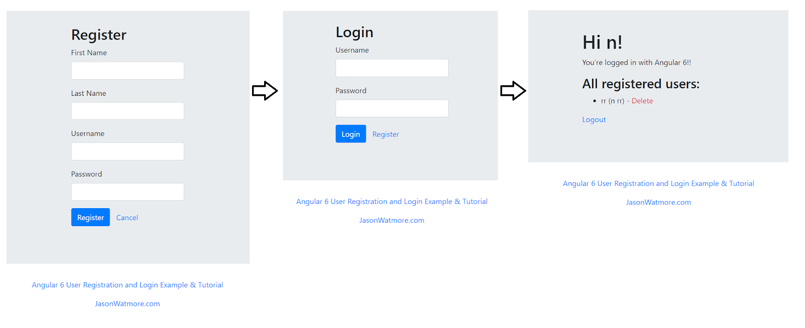
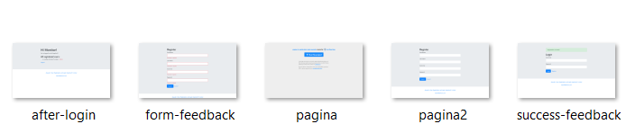

### ¿Para qué automatizar la ejecución de un navegador web?

Los navegadores son aplicaciones cuya principal función es permitir el acceso a contenido web al consultar información 
de servidores en internet (por medio de varios protocolos) y renderizar contenido mixto en una interfaz gráfica. Las 
aplicaciones web existen en función de estos navegadores, ya que son la principal plataforma de interacción para ellas y, 
por ende, representan un objetivo importante al momento de hacer pruebas automáticas sobre este tipo de aplicaciones. 
Teniendo en cuenta lo anterior, es apenas natural hacer pruebas E2E para validar el comportamiento de las aplicaciones 
web. Esto se hace por medio de herramientas como Playwright, que automatizan la interacción con los navegadores web por 
medio de comandos escritos en un lenguaje de programación convencional. De esta forma es posible explorar la totalidad 
de las aplicaciones web que desee probar.

### ¿Qué es Playwright?
Playwright es una librería lanzada en 2020 que brinda un API para automatizar los navegadores Chromium, 
Firefox y WebKit. Su apuesta principal es la automatización de aplicaciones web sobre múltiples navegadores. 
Está disponible únicamente para Node.js y soporta la mayoría de las interacciones y modificaciones sobre los navegadores 
más recientes. Este proyecto es mantenido por Microsoft.

### ¿Qué construirá?
- Un proyecto de Node.js con un script que interactúa con una aplicación web.
- Un directorio de screenshots con imágenes de tres pantallas.

### ¿Qué necesita?
Una versión actualizada de Node.js instalada en su computadora.
Una versión actualizada del manejador de paquetes npm instalada en su computadora.

**Nota**: se recomienda realizar la instalación de Node.js en la versión estable que se muestra en la parte izquierda del 
sitio oficial con la etiqueta "Recomendado para la mayoría". Esta instalación suele venir con npm, la compatibilidad 
entre ambas herramientas es ideal.

### Conocer Playwright
Playwright es un proyecto de código abierto. Este se aloja en un repositorio público de GitHub al cual puede acceder en 
el siguiente enlace: https://github.com/microsoft/playwright. Se sugiere que lea la documentación presente en el archivo 
Readme.md de este repositorio para comprender todos los detalles necesarios para automatizar cada aspecto posible de un 
navegador.

### Conocer los principios de Playwright
Como se indica en la documentación oficial, Playwright es un API que permite automatizar Chromium, Firefox y Webkit 
desde Linux, Windows y MacOS. Desde el momento de instalación de Playwright se descargan archivos binarios conteniendo 
los navegadores mencionados. Estos archivos contienen diferentes versiones de los navegadores, ya que requieren expandir 
su funcionalidad para soportar la automatización de ciertos eventos y su funcionamiento en modo headless.

Las funciones del API de Playwright son asíncronas, y los programas que le utilizan típicamente parten de una función 
flecha asíncrona sin nombre que se llama a sí misma, de la forma (async ()=>{//code})();. El API de Playwright permite 
trabajar con tres objetos principales para la automatización de los navegadores, que son Browser, BrowserContext y Page. 
El primero contiene una de las instancias de los navegadores mencionados, el segundo contiene una abstracción de la 
configuración específica del navegador, y el tercero permite abstraer una página web, por lo cual será fundamental para 
referirse a la interfaz de la aplicación web e interactuar con acciones básicas.

### Conocer las funcionalidades de Playwright
Playwright brinda soporte para el comportamiento de páginas del tipo Single Page Application y Progressive Web 
Application, lo cual le hace una herramienta bastante confiable, pues cubre múltiples tipos de necesidades. Además, 
es capaz de crear escenarios donde se requiere acceder a múltiples dominios con iframes embebidos, interceptar y 
modificar eventos de red, emular dispositivos, permisos y ubicación geográfica, simulación de interrupciones nativas de 
mouse y teclados, además de descargar y subir archivos.

Las funcionalidades específicas que se pueden incluir con Playwright se pueden resumir a niveles generales en la página 
de documentación de la clase Page, la cual puede consultar en el siguiente enlace: https://playwright.dev/docs/api/class-page/.

Explore las funciones allí expuestas, prestando especial atención a aquellas que representan los eventos más comunes e 
intuitivos, como por ejemplo click, dblclick, fill, check, goto, hover, screenshot. Podrá notar una presencia importante 
del uso de selectores en todas las funciones, y por este motivo es importante que adquiera familiaridad también con el 
funcionamiento de los selectores. Para lograr esto, lea el contenido del siguiente enlace, que lleva a un apartado de la 
documentación oficial que explica todos los detalles de selectores: https://playwright.dev/docs/selectors/

### Comprender la prueba que construirá
Para el caso de este tutorial se harán pruebas para verificar la correcta funcionalidad de una sencilla página web 
construida en Angular, cuya única funcionalidad es permitir el registro, inicio de sesión y visualización de los usuarios 
creados.

### Interactuar con la interfaz web objetivo
Ingrese al siguiente enlace para conocer la aplicación en cuestión: https://angular-6-registration-login-example.stackblitz.io/register.
Interactúe con los botones "Register" y "Cancel" y luego proceda a llenar el formulario de registro. Verá que ahora será 
redirigido a la página de login, pero tendrá un mensaje adicional indicando el éxito de la operación de registro. Ingrese 
ahora con las credenciales que recién registró y podrá ver una página con su nombre de usuario.

El flujo estándar de esta aplicación debería ser como el de la siguiente imagen:



Sin embargo, usted podrá notar que existen ciertos detalles que pueden variar según las condiciones del escenario.

### Listar las acciones que comprenden la prueba
Para el caso de este tutorial, basta con que aprenda a hacer operaciones básicas en su prueba como abrir URLs, hacer clics, llenar campos de texto y consultar la presencia de determinados elementos gráficos. En particular, se espera construir una prueba que haga lo siguiente:

1. Lanzar un navegador e ingresar a la página web de ejemplo.
2. Hacer clic en el enlace "Cancel" y verificar la URL. (Guardar captura).
3. Hacer clic en el enlace "Register" y verificar la URL. (Guardar captura).
4. Hacer clic en el botón "Register" y verificar la existencia del texto de retroalimentación del campo del nombre. (Guardar captura).
5. Llenar todos los campos del formulario de registro con valores cualquiera y la contraseña "MISO4208".
6. Hacer clic en el botón "Register" y verificar la existencia del mensaje de éxito en la creación del usuario.
7. Llenar los campos del formulario de inicio de sesión con las mismas credenciales.
8. Hacer clic en el botón "Login" y verificar la existencia del nombre de usuario en el listado de usuarios.

### Implementar la prueba sobre la aplicación objetivo

**Crear un proyecto para la prueba**:
En primer lugar, debe asegurarse de crear un proyecto haciendo uso de Node.js para poder crear y ejecutar la prueba con 
Playwright. Para esto, abra una terminal y ubíquese en un directorio vacío donde vaya a ubicar el proyecto de este 
tutorial. Una vez allí ejecute el siguiente comando:
```bash
npm init -y
```

De esta forma, habrá inicializado un proyecto de Node.js. Podrá ver que en su directorio se creó un archivo 
```package.json``` con valores por defecto (a causa del flag -y). Ahora podrá instalar las dependencias necesarias en 
este proyecto.

### Instalar las dependencias
Actualmente su proyecto de Node.js únicamente contiene un archivo con metadatos del proyecto, pero no cuenta con los archivos a ejecutar ni con las dependencias necesarias. Para instalar y utilizar Playwright en sus pruebas, debe instalar el paquete de npm con el siguiente comando:

```bash
npm install playwright
npx playwright install
```

Esto agregará las líneas necesarias a su archivo package.json para declarar Playwright como dependencia del proyecto, 
creará un archivo ```package-lock.json``` e instalará Playwright en el directorio ```node_modules```.

Implementar las acciones de la prueba
Como está declarado en su archivo ```package.json```, el punto de entrada de su aplicación será el archivo ```index.js```,
ubicado en el directorio del proyecto. Cree dicho archivo e inicialmente agregue el siguiente contenido para tener la 
estructura básica de un programa de Playwright:


```javascript
//Importar Playwright
const playwright = require('playwright');

const url = '';

//Función flecha asíncrona
(async () => {
  //Definir los navegadores en los que se quiere hacer la prueba
  for (const browserType of ['chromium']){//, 'firefox', 'webkit']) {
    //Contenido de la prueba
    console.log(browserType+'-------------------------------------------')

    //Creación del objeto browser, el contexto del mismo y el objeto page para manejar la página
    const browser = await playwright[browserType].launch();
    const context = await browser.newContext();
    const page = await context.newPage();
    
    //Abrir la URL a probar en la página y cargar el proyecto en una SPA
    await page.goto(url);
    await new Promise(r => setTimeout(r, 7000));
    await page.screenshot({path: './pagina.png'})
    await page.click('css=button')
    await new Promise(r => setTimeout(r, 9000));
    await page.screenshot({path: './pagina2.png'})
    console.log('Project loaded')


    //Interactuar con la aplicación web
    //...

    //Finalizar la prueba
    await browser.close();
  }
  return;
})();//Llamado propio de la función
```

En este archivo ya podrá incluir las instrucciones particulares de la prueba que se planteó previamente en este tutorial.
En primer lugar, debe cambiar el valor de la constante ```url``` por 
‘https://angular-6-registration-login-example.stackblitz.io/register'. Opcionalmente, también puede eliminar dos de los
navegadores del arreglo para realizar la prueba una única vez.

Recuerde el listado de acciones del paso anterior del tutorial. Las verificaciones que se mencionaron las hará por medio 
de llamados a la función console.log.

Ahora, en este mismo archivo, debe agregar las instrucciones que le permiten interactuar con los elementos correspondientes. 
En la sección de su archivo que contiene los comentarios "Interactuar con la aplicación web" y "...", debe agregar las 
siguientes instrucciones:


```javascript

//Importar Playwright
const playwright = require('playwright');

const url = '';

//Función flecha asíncrona
(async () => {
   //Definir los navegadores en los que se quiere hacer la prueba
   for (const browserType of ['chromium']){//, 'firefox', 'webkit']) {
      //Contenido de la prueba
      console.log(browserType+'-------------------------------------------')

      //Creación del objeto browser, el contexto del mismo y el objeto page para manejar la página
      const browser = await playwright[browserType].launch();
      const context = await browser.newContext();
      const page = await context.newPage();

      //Abrir la URL a probar en la página y cargar el proyecto en una SPA
      await page.goto(url);
      await new Promise(r => setTimeout(r, 7000));
      await page.screenshot({path: './pagina.png'})
      await page.click('css=button')
      await new Promise(r => setTimeout(r, 9000));
      await page.screenshot({path: './pagina2.png'})
      console.log('Project loaded')


      await page.click('css=a.btn.btn-link')
      console.log(`Clicked "cancel". URL is now ${page.url()}`)

      await page.click('css=a.btn.btn-link')
      console.log(`Clicked "register". URL is now ${page.url()}`)

      await page.click('css=button.btn.btn-primary')
      let feedback = await page.$$('css=div.invalid-feedback');

      let elems=0
      for(let i of feedback){elems++}
      await page.screenshot({path:'./form-feedback.png'})
      console.log(`Clicked "Register" with an empty form. Feedback is shown in ${elems} elements`)

      await page.type('input[formcontrolname="firstName"]', 'Monitor');
      await page.type('input[formcontrolname="lastName"]', 'Pruebas');
      await page.type('input[formcontrolname="username"]', 'pruebas');
      await page.type('input[formcontrolname="password"]', 'MISO4208');
      await page.click('css=button.btn.btn-primary')

      await new Promise(r => setTimeout(r, 7000));
      await page.screenshot({path:'./success-feedback.png'})

      feedback = await page.$("css=div.alert.alert-success")
      console.log(`Success dialog after creating user with message: ${await feedback.innerText()}`)

      await page.type('input[formcontrolname="username"]', 'pruebas');
      await page.type('input[formcontrolname="password"]', 'MISO4208');
      await page.click('css=button.btn.btn-primary')
      await new Promise(r => setTimeout(r, 7000));

      feedback = await page.$('text="Hi Monitor!"');
      await page.screenshot({path:'./after-login.png'})
      console.log(`Logged in. Your user was ${feedback?'successfully':'not'} created`)
      //Interactuar con la aplicación web
      //...
      //Finalizar la prueba
      await browser.close();
   }
   return;
})();
```

Lea el código e identifique qué instrucciones corresponden a las acciones de la prueba que se enunciaron en el paso 
anterior. Podrá notar que en varios momentos se toma una captura de pantalla, la cual se almacena en el directorio raíz 
(no obstante, este directorio se puede cambiar con el path indicado). Así mismo, podrá notar que en ciertos momentos se 
agregaron tiempos de espera de forma manual con la instrucción ```await new Promise(r => setTimeout(r, 7000)),``` esto se debe
a que el comportamiento de esta página web, como el de varias SPA desarrolladas en Angular, es diferente al flujo 
tradicional y, por ende, maneja de forma distinta los eventos del navegador.


### Ejecutar la prueba
Para ejecutar el escenario, es necesario que haya guardado el archivo anterior. Desde una terminal, ubíquese en el 
directorio raíz del proyecto de npm que creó, y ejecute el comando ```node index.js```, el cual corre el contenido de su 
archivo index.js con el motor de ```Node.js```.


### Ver los resultados obtenidos
En primer lugar, al ejecutar la prueba podrá ver en su terminal los registros que se escribieron manualmente con las 
instrucciones console.log. Estos fueron incluidos según las acciones que comprenden la prueba, las cuales se listaron 
en un paso anterior. Por sí solo, Playwright no ofrece ninguna funcionalidad de reportes o registros de la prueba, 
así que es necesario incluirla dentro de todas las pruebas. Por otro lado, Playwright sí ofrece la posibilidad de 
generar imágenes o archivos .pdf con las capturas de pantalla de la página web en cierto momento.

En el caso de esta prueba también se incluyeron instrucciones page.screenshot para generar estas imágenes. Desde un 
explorador de archivos podrá ver las imágenes generadas en el directorio raíz, las cuales deben contener los archivos 
de la siguiente imagen:





Notará que las imágenes muestran las vistas más importantes del recorrido que usted hizo de forma manual mientras 
exploraba la página. Estas imágenes podrá utilizarlas luego de la forma que lo requiera.